# CT India - One App. One City. Everything You Need.

## 📱 Overview

CT India is a comprehensive city services app that brings together essential services like food delivery, ride booking, shopping, and pharmacy services under one platform. Our mission is to simplify urban living by providing a seamless, integrated experience for all your daily needs.

## ✨ Key Features

### 1. Splash Screen
- Modern logo design featuring CT India branding
- Tagline: "One App. One City. Everything You Need."

### 2. Authentication
- **Mobile Authentication**
  - OTP-based mobile verification
  - Social login integration (Google, Instagram, LinkedIn)
  - Email + password authentication
  - Enhanced security with CAPTCHA & 2FA support

### 3. User Onboarding
- Interactive feature showcase slides
- Highlights of key services:
  - Food delivery
  - Travel services
  - Shopping
  - And more...

### 4. Profile Management
- Personal information setup
  - Name and profile photo
  - Contact details (email, mobile)
  - Location settings with GPS integration
- Service preferences
  - Food preferences
  - Shopping categories
  - Ride options

### 5. Dashboard
- **Modern Glassmorphism UI Design**
- Quick-access service icons:
  - 🍴 Food
  - 🛵 Ride
  - 🧥 Fashion
  - 💊 Medicine
  - 🛍️ Shopping
- Featured offers and promotional banners
- Universal search functionality
- Bottom navigation bar

### 6. Core Services

#### Food Delivery
- Restaurant discovery
- Advanced filters (Veg/Non-Veg, ratings, delivery time)
- Real-time order tracking
- Cart management and payment processing
- Promo code support

#### Ride Booking
- Location-based booking
- Fare estimation
- Driver tracking
- Real-time ride status

#### Shopping
- Fashion categories
  - Kurtis
  - Dresses
  - Jeans
  - And more
- Advanced filtering options
- Quick purchase options

#### Pharmacy
- Prescription upload
- Medicine browsing
- Pharmacy locator
- Delivery time estimates

### 7. Order Management
- Comprehensive order history
- Quick reorder functionality
- Digital invoice access
- Customer support integration

### 8. Digital Wallet
- Balance management
- Fund addition
- UPI/Bank integration
- Transaction history

### 9. Notifications
- Order status updates
- Promotional offers
- Personalized recommendations

### 10. Settings & Support
- Account management
- Customer care access
- App customization
  - Language selection
  - Theme options
- Secure logout

## 🛠️ Technical Stack

### Frontend
- Flutter/React Native for cross-platform development

### Backend
- Node.js + Express
- Firebase (Alternative)

### Database
- MongoDB
- Firebase
- PostgreSQL

### Integrations
- Google Maps API for location services
- Payment gateways:
  - Razorpay
  - Paytm
  - Stripe
- Authentication:
  - Firebase Auth
  - Auth0
- Push Notifications:
  - Firebase Cloud Messaging (FCM)

## 🚀 Future Enhancements

### Planned Features
- AI-powered customer support chatbot
- Voice command functionality
- QR code-based ride sharing
- City-level analytics for personalized offers
- Community features and review system

## 📱 Platform Support
- iOS
- Android

## 🔒 Security
- End-to-end encryption
- Secure payment processing
- Data privacy compliance
- Regular security audits

## 🤝 Contributing
We welcome contributions! Please read our contributing guidelines before submitting pull requests.

## 📄 License
This project is licensed under the MIT License - see the LICENSE file for details.

## 📞 Support
For support, email support@ctindia.com or visit our website www.ctindia.com

---
Made with ❤️ by CT India Team 

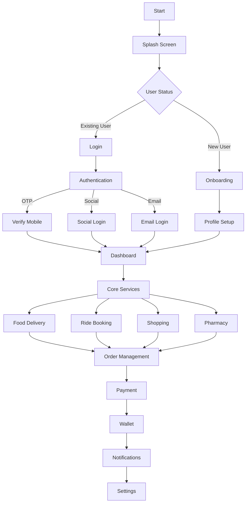

## 📱 Core Service Workflows

### 1. Food Delivery Flow
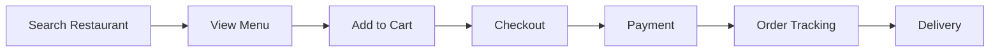

### 2. Ride Booking Flow
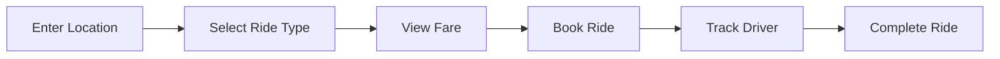

### 3. Shopping Flow
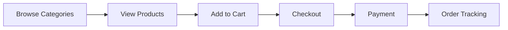

### 4. Pharmacy Flow
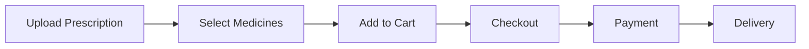

## 💳 Payment Workflow
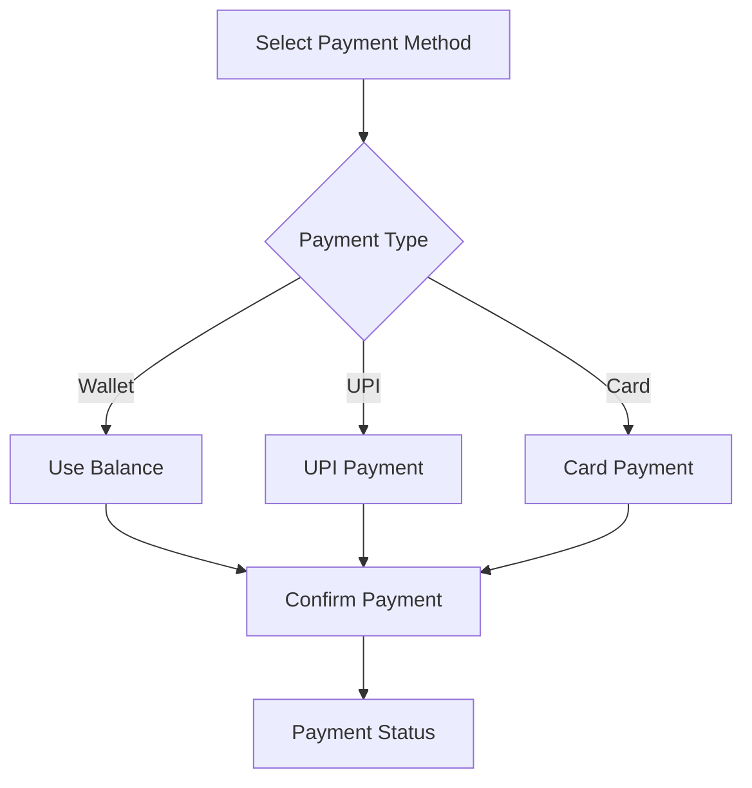

## 🔐 Authentication Flow
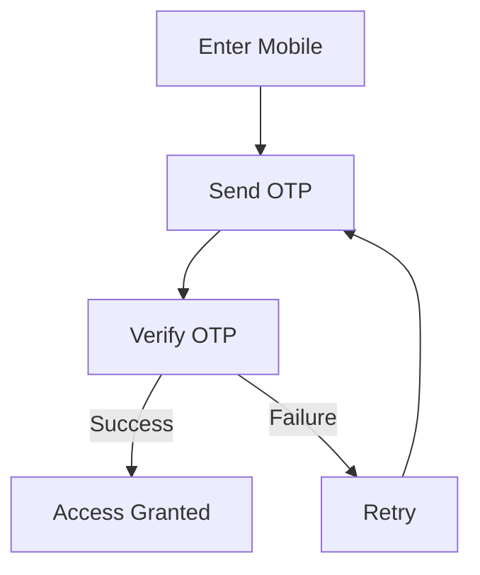

## 📊 System Architecture Flow
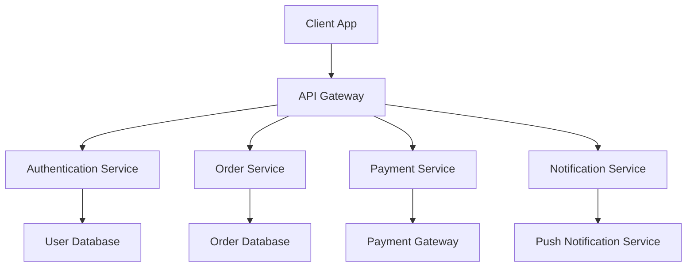

## 🔄 Data Flow
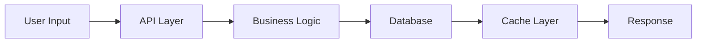

## 📱 Mobile App States
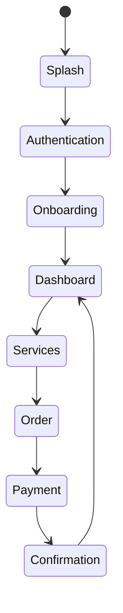

## 🔒 Security Flow
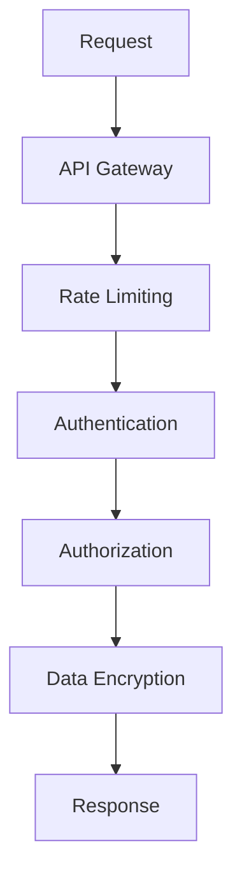

## 📈 Error Handling Flow
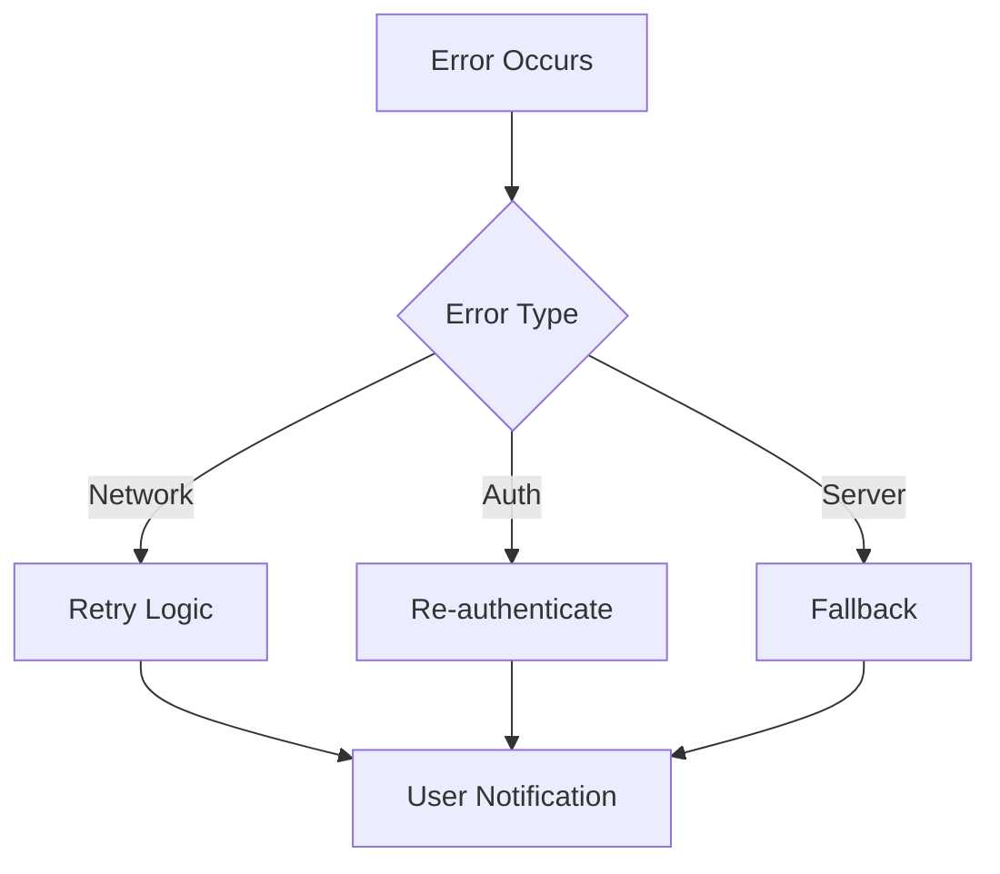

## 🔄 Cache Strategy
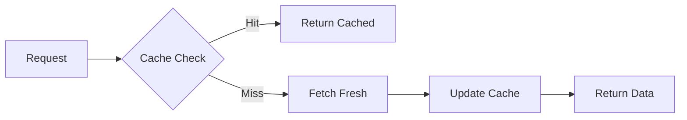
